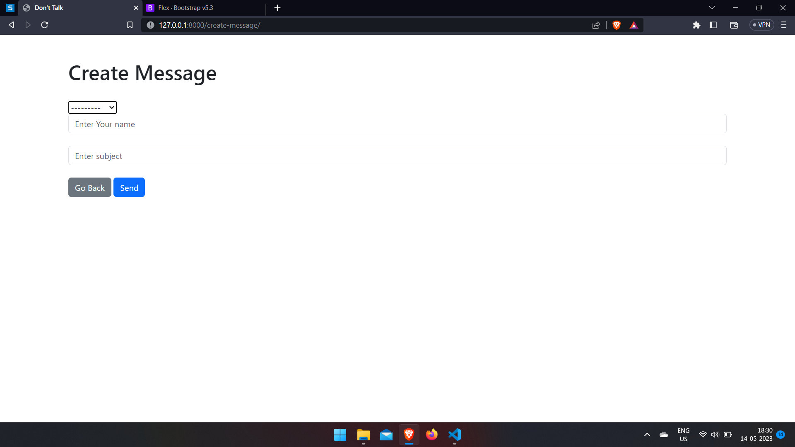

# simple-chat-app
 
**Live link :- https://chat-api-k2dg.onrender.com**

**Run command in shell/teminal**
> python manage.py runserver

* Each user will have there own inbox where they can view all the recieved and sent messages.
* Authentication and security is maintained using authentication module.

              

